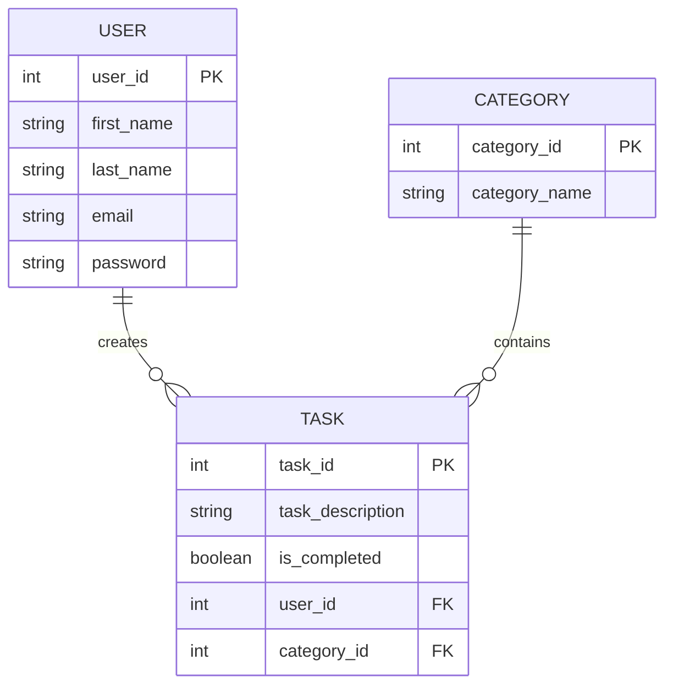

# Personal Task Manager (Todo App)

## Project Description
A simple web-based to-do list application that helps users organize and manage their daily tasks and projects. Users can create tasks, mark them as complete, edit existing tasks, and delete tasks they no longer need.

## Business Rules

### User and Task Relationship
- A USER may create many TASKs. A TASK is created by exactly one USER.

### Task and Category Relationship
- Each TASK may belong to exactly one CATEGORY. A CATEGORY may contain many TASKs.

## Database Design

### Entity Relationship Diagram (ERD)

The following diagram illustrates the logical structure of our database using Mermaid notation, representing each entity as a box containing its attributes.

### Relational Schema

The following relations (tables) consist of connected boxes for each attribute, specifically highlighting the **Primary Keys (PK)** and **Foreign Keys (FK)** as requested.

#### 1. USER Relation
| **user_id (PK)** | **first_name** | **last_name** | **email** | **password** |
| :--- | :--- | :--- | :--- | :--- |

#### 2. TASK Relation
| **task_id (PK)** | **task_description** | **is_completed** | **user_id (FK)** | **category_id (FK)** |
| :--- | :--- | :--- | :--- | :--- |

#### 3. CATEGORY Relation
| **category_id (PK)** | **category_name** |
| :--- | :--- |

> [!IMPORTANT]
> - **Primary Keys (PK)** uniquely identify each record in its respective table.
> - **Foreign Keys (FK)** establish the link between tables, ensuring data integrity.

## Normalization (Assignment 5)

This database design has been normalized to the **Third Normal Form (3NF)**:

1.  **1st Normal Form (1NF)**:
    - All attributes are atomic (no multi-valued or nested attributes).
    - Each table has a unique Primary Key (`user_id` for Users, `task_id` for Tasks).
2.  **2nd Normal Form (2NF)**:
    - Meets all 1NF requirements.
    - No partial dependencies exist. All non-key attributes depend on the entire primary key.
3.  **3rd Normal Form (3NF)**:
    - Meets all 2NF requirements.
    - No transitive dependencies exist. Every non-key attribute depends only on the primary key.

## Features
1. **User Authentication System**:
   - User Registration (First Name, Last Name, Email, Password)
   - User Login
2. **Task Management**:
   - Create, View, Edit, and Delete Tasks.
   - Categorize tasks for better organization.
3. **Navigation**:
   - Seamless navigation between Register, Login, and Task Management pages.

## Database Implementation
The SQL source code for creating the database schema can be found in [tables.sql](./tables.sql).

## Technologies Used
- HTML5
- CSS
- JavaScript
- MySQL (Database Schema implemented in [tables.sql](./tables.sql))
