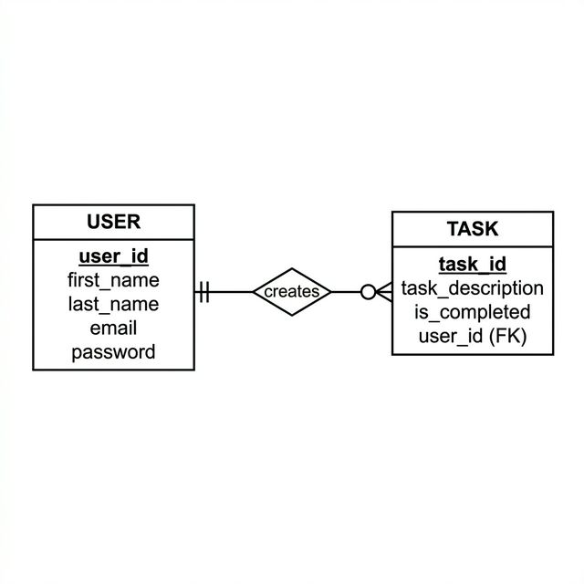

# Personal Task Manager (Todo App)

## Project Description
A simple web-based to-do list application that helps users organize and manage their daily tasks and projects. Users can create tasks, mark them as complete, edit existing tasks, and delete tasks they no longer need.

## Business Rules

### Relationship: USER creates TASK
1. `<USER> <may> <create> <any number> <TASK>`
   *A USER may create any number of TASKs. However, each TASK must be created by exactly one USER.*
2. `<TASK> <must> <belong to> <exactly one> <USER>`
   *Each TASK must be created by exactly one USER. However, a USER may have zero or more TASKs.*

## Entity Relationship Diagram (ERD)

> [!NOTE]
> The ERD above represents the relationship between Users and Tasks. A User can have multiple tasks, while each task belongs to a single User.

## Features
1. **User Authentication System**:
   - User Registration (First name, Last name, Email, Password)
   - User Login
2. **Task Management**:
   - Create, View, Edit, and Delete Tasks.
3. **Navigation**:
   - Seamless navigation between Register, Login, and Task Management pages.

## Technologies Used
- HTML5
- CSS3 (Vanilla)
- JavaScript
- Database (Planned for future assignments)
