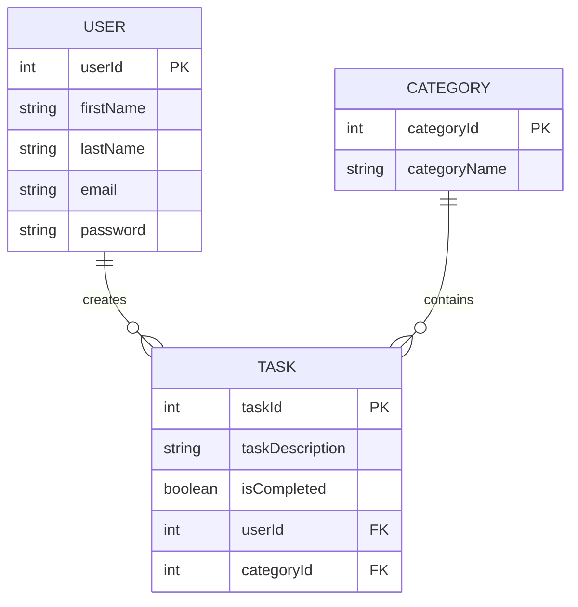

# Personal Task Manager (Todo App)

## Project Description
A simple web-based to-do list application that helps users organize and manage their daily tasks and projects. Users can create tasks, mark them as complete, edit existing tasks, and delete tasks they no longer need.

## Business Rules

### User and Task Relationship
- A USER may create many TASKs. A TASK is created by exactly one USER.

### Task and Category Relationship
- Each TASK may belong to exactly one CATEGORY. A CATEGORY may contain many TASKs.

## Database Design

### Entity Relationship Diagram (ERD)

The following diagram illustrates the logical structure of our database using Mermaid notation, which represents each entity as a box containing its attributes.

### Relational Schema

The following relations (tables) consist of connected boxes for each attribute, specifically highlighting the **Primary Keys (PK)** and **Foreign Keys (FK)** as requested.

#### 1. USER Relation
| **userId (PK)** | **firstName** | **lastName** | **email** | **password** |
| :--- | :--- | :--- | :--- | :--- |

#### 2. TASK Relation
| **taskId (PK)** | **taskDescription** | **isCompleted** | **userId (FK)** | **categoryId (FK)** |
| :--- | :--- | :--- | :--- | :--- |

#### 3. CATEGORY Relation
| **categoryId (PK)** | **categoryName** |
| :--- | :--- |

> [!IMPORTANT]
> - **Primary Keys (PK)** uniquely identify each record in its respective table.
> - **Foreign Keys (FK)** establish the link between tables, ensuring data integrity (e.g., a Task must be linked to a valid User).

## Features
1. **User Authentication System**:
   - User Registration (Full Name, Email, Password)
   - User Login
2. **Task Management**:
   - Create, View, Edit, and Delete Tasks.
   - Categorize tasks for better organization.
3. **Navigation**:
   - Seamless navigation between Register, Login, and Task Management pages.

## Technologies Used
- HTML5
- CSS3 (Vanilla)
- JavaScript
- Database (Planned for future assignments)
