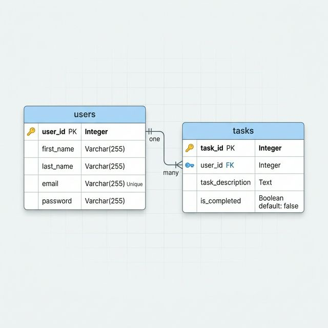
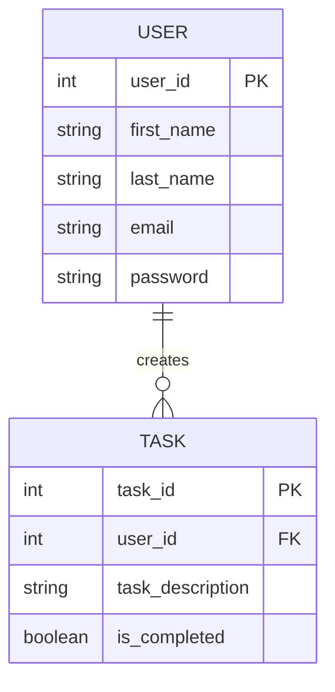

# Personal Task Manager (Todo App)

## Project Description
A simple web-based to-do list application that helps users organize and manage their daily tasks and projects. Users can create tasks, mark them as complete, edit existing tasks, and delete tasks they no longer need.

## Business Rules

### Relationship: USER creates TASK
1. `<USER> <may> <create> <any number> <TASK>`
   *A USER may create any number of TASKs. However, each TASK must be created by exactly one USER.*
2. `<TASK> <must> <belong to> <exactly one> <USER>`
   *Each TASK must be created by exactly one USER. However, a USER may have zero or more TASKs.*

## Entity Relationship Diagram (ERD)

### Mermaid Representation (Dynamic)

> [!NOTE]
> The ERD above represents the relationship between Users and Tasks. A User can have multiple tasks, while each task belongs to a single User.

## Normalization (Assignment 5)

This database design has been normalized to the **Third Normal Form (3NF)**:

1.  **1st Normal Form (1NF)**:
    - All attributes are atomic (no multi-valued or nested attributes).
    - Each table has a unique Primary Key (`user_id` for Users, `task_id` for Tasks).
2.  **2nd Normal Form (2NF)**:
    - Meets all 1NF requirements.
    - No partial dependencies exist. Since both tables use a single-column primary key, all non-key attributes automatically depend on the entire primary key.
3.  **3rd Normal Form (3NF)**:
    - Meets all 2NF requirements.
    - No transitive dependencies exist. Every non-key attribute (e.g., `first_name`, `task_description`) depends only on the primary key and not on any other non-key attribute.

## Database Implementation

The SQL source code for creating the database schema can be found in [tables.sql](./tables.sql).

## Technologies Used
- HTML5
- CSS
- JavaScript
- MySQL (Database Schema implemented in [tables.sql](./tables.sql))
